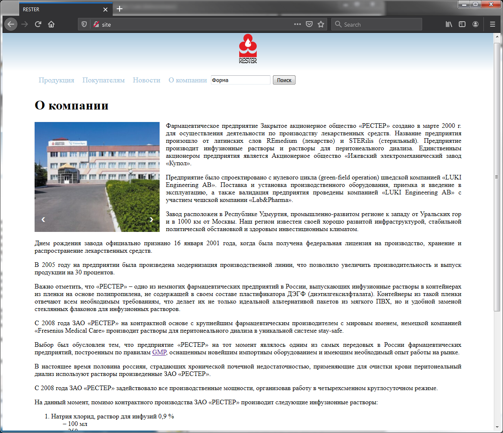

# Поиск по содержимому статичных страниц
- выполняется полнотекстовый поиск (как по заголовку, так и по основному тексту);
- поиск регистронезависимый;
- на странице поиска выводится поисковый запрос;
- выводится список найденных страниц или сообщение если по запросу ничего не найдено;
- для защиты от SQL-инъекций используется приведение к типу integer (переход по страницам) – settype();
- для защиты от SQL-инъекций и XSS-атак используется обработка поискового запроса с помощью регулярных выражений в функции preg_match().

Пример поиска – запрос "Форма":

Пример результатов поиска – запрос "Форма":

